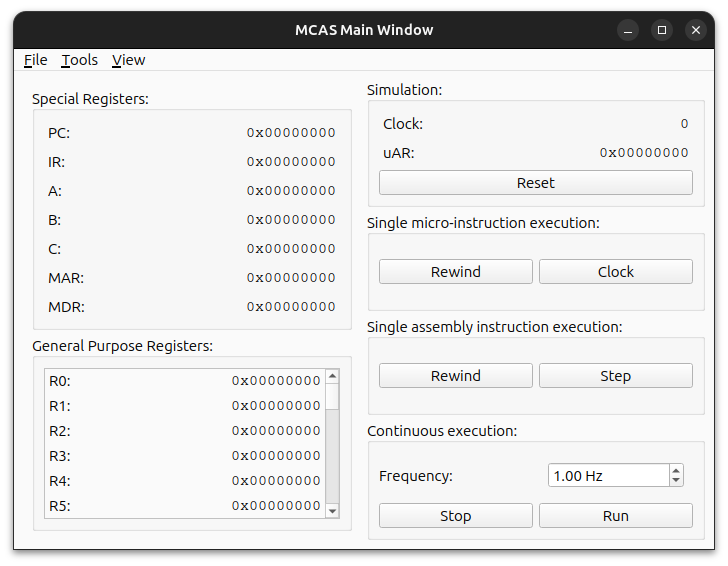
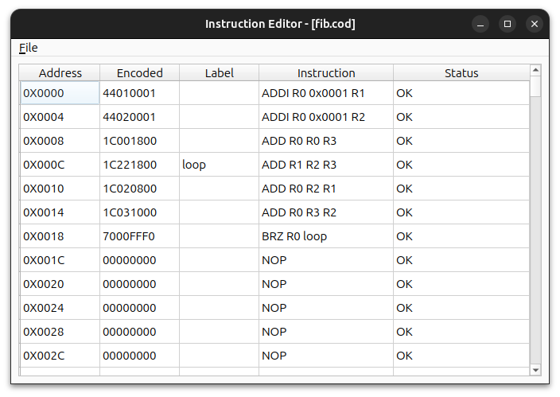
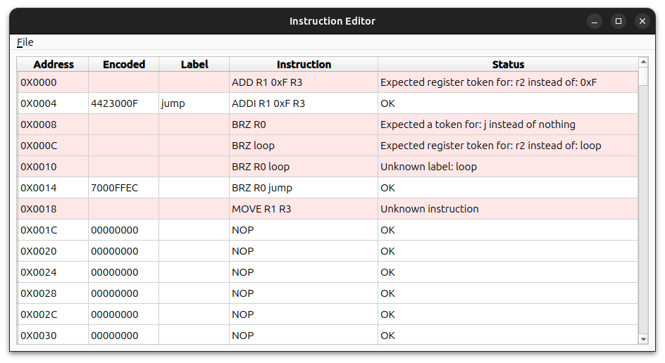
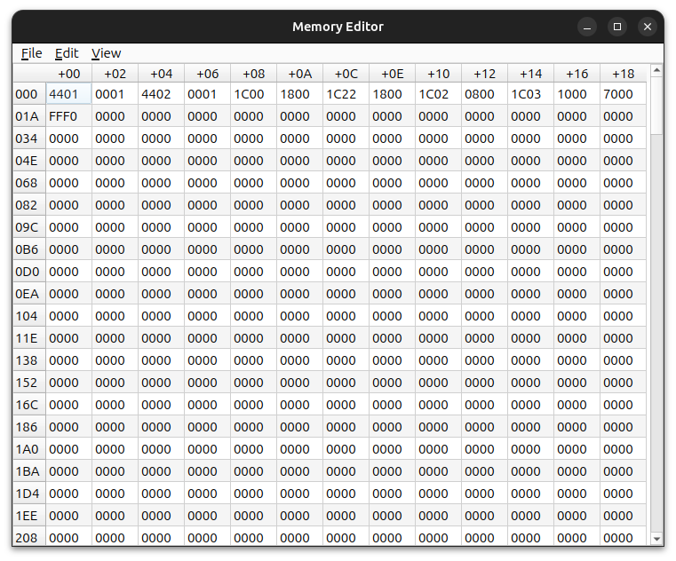
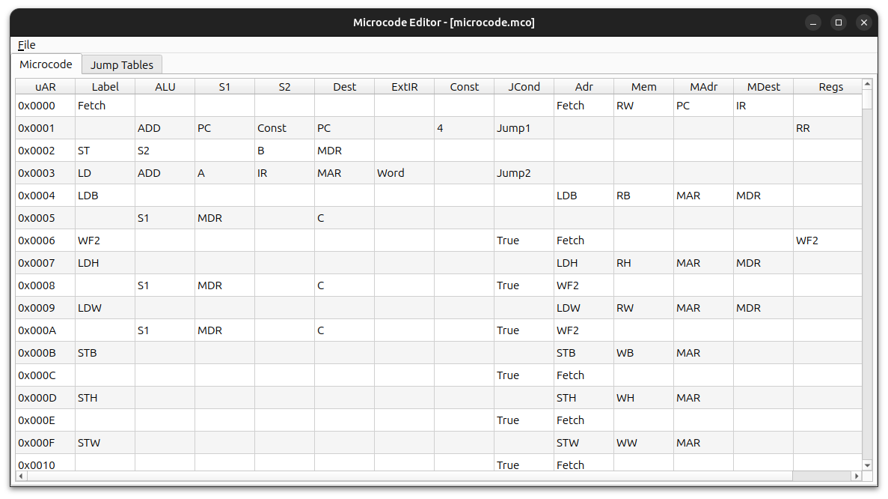

# MCAS - Microprogrammed Computer Architecture Simulator

MCAS is a desktop application for simulating a microprogrammed computer architecture at the micro-instruction level. It is designed as an educational tool that exposes the internal workings of a processor while maintaining a modern, intuitive user interface. The exact simulated architecture is DLX - an educational CISC architecture proposed by *Hennesey and Patterson* in *"Computer Architecture: A Quantitative Approach"*.

The project combines low-level architectural transparency with usability, addressing limitations of both legacy academic tools and modern high-level simulators.


## Highlights

- Micro-instruction level simulation with deterministic execution
- Fully configurable instruction set and microcode
- Multiple execution modes (step, micro-step, run, rewind)
- Real-time visualization of processor state
- Modern, cross-platform Qt-based interface
- Designed specifically for teaching and understanding computer architecture

## Technologies

- C++17
- Qt (GUI framework)
- Qt Model–View–Delegate
- Qt Linguist (i18n)
- CMake

## Build

### Requirements
- C++17 compiler
- Qt6 (at least 6.8.3)
- CMake

### STEP 1: Clone the repository
```bash
git clone https://github.com/SSu4K/MCAS.git
cd MCAS
```
### STEP 2: Configure:
```bash
mkdir build
cmake -S . -B build
```
If fails, point cmake to your Qt installation:
- Linux
```bash
cmake -S . -B build \
      -DCMAKE_PREFIX_PATH=<installation>/Qt/<version>/<compiler>
```
- Windows
```bash
cmake -S . -B build ^
      -DCMAKE_PREFIX_PATH="<installation>\Qt\<version>\<compiler>"
```
### STEP 3: Build:
```bash
cmake --build build --target MCAS --config Release
```

### STEP 4: Run:
- Linux
```bash
./build/src/MCAS
```
- Windows
```bash
build\src\MCAS.exe
```

### Build alternative
Alternatively the project can be built using the *QtCreator* IDE. If you can have it installed, the repository can be opened as a *QtCreator* project based on the `MCAS\CMakeLists.txt` file. Then the IDE can handle configuration, build and run.

## Screenshots
### Simulation Window
<p align="center">
  
</p>

### Instruction Editor
<p align="center">
  
  
</p>

### Memory Editor
<p align="center">
  
</p>

### Microcode Editor
<p align="center">
  
</p>

## Feature Overview

### Simulation Engine
- Single-clock micro-instruction execution
- Accurate control flow via microcode and jump tables
- Full machine state visibility (registers, memory, control state)
- Deterministic assembly and disassembly pipeline supporting informative error messages

### Execution Control
- Micro-instruction stepping
- Instruction-level stepping
- Continuous execution with adjustable frequency
- Execution rewind
- System reset

### Editing Tools
- Instruction editor with live validation and error reporting
- Memory editor with multiple data representations (byte/half/word)
- Microcode and jump table editor with constrained input
- Instruction set configuration editor

### User Interface
- Multi-window desktop application (Qt)
- Synchronized views using signal–slot architecture
- Internationalization (English / Polish)
- Theme support
